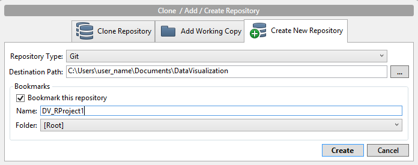

### 00. Create a github repository
Go to SourceTree software. Create new git repository in DataVisualization folder (on same level as DrCannata folder).

### 00.5 Clone Repo
If did not create the repo, clone the repo in SourceTree software.

### 01. Create RStudio Project

### 02. Setup RStudio 

### 03. Build Dataframe

### Hello
### 04. Display Subset of Dataframe

#### Subset of Titanic Dataframe:

### 05. Display Summary of Dataframe

#### Summary of Titanic Dataframe:

### 06. Interesting Data

### 07. Other plots

### efdfdsf

