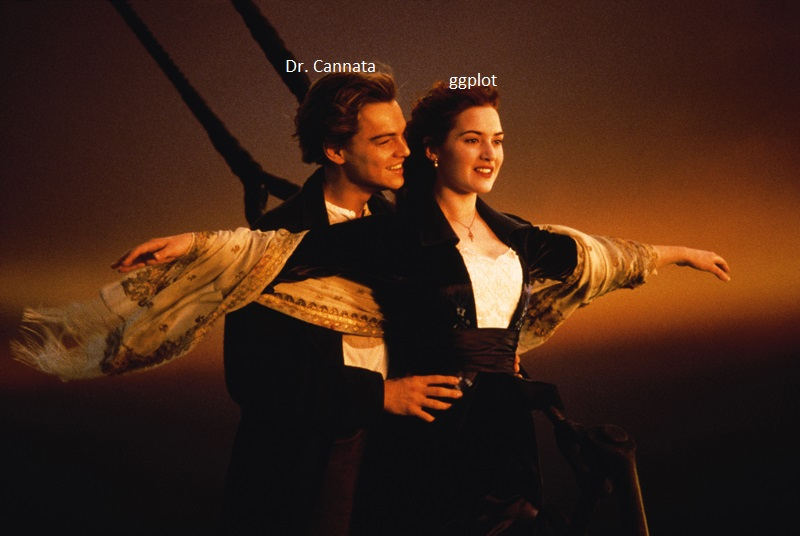
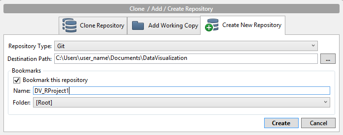
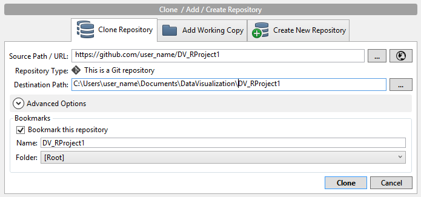
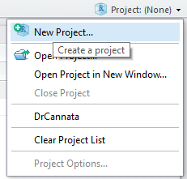
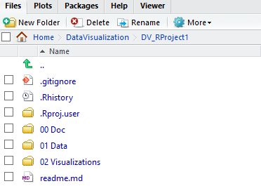
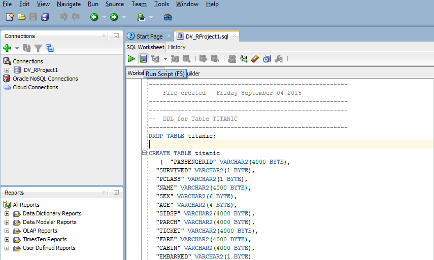

  

## 00. Create/Clone a github repository
Go to SourceTree software. Create new git repository in DataVisualization folder (on same level as DrCannata folder).


If did not create the repo, clone the repo in SourceTree software.


## 01. Create RStudio Project
Create an RStudio project in the project folder.   


## 02. Setup RStudio 
 Create three folders in RStudio Project:  
   **00 Doc**: where .Rmd lives  
   **01 Data**: where data will be stored  
   **02 Visualizations**: where data is explored in ggplot  


## 03. Build Dataframe
1. Create sqldeveloper worksheet from SQL titanic data.  
  

2. Extract data from sqldeveloper to dataframe "df" using SQL:

```{r}
df <- data.frame(fromJSON(getURL(URLencode('129.152.144.84:5001/rest/native/?query="select * from titanic"'),httpheader=c(DB='jdbc:oracle:thin:@129.152.144.84:1521/PDBF15DV.usuniversi01134.oraclecloud.internal', USER='cs329e_jht585', PASS='orcl_jht585', MODE='native_mode', MODEL='model', returnDimensions = 'False', returnFor = 'JSON'), verbose = TRUE), ))
```  

## 04. Display Summary of Dataframe

### Summary of Titanic Dataframe:
```{r}
summary(df)
```  

## 05. Display Subset of Dataframe

### Subset of Titanic Dataframe:

## 06. Interesting Data

## 07. Other plots
```{r, echo=FALSE, warning=FALSE}
source("../02 Visualizations/Titanic_plot1.R")
plot1
```

```{r, echo=FALSE, warning=FALSE}
source("../02 Visualizations/Titanic_plot2.R")
plot2
```

Comment on Plot 1 and 2:

- High percentage of male on the ship is in age range 20 to 40.

- For males, most fares are below 100. While for females, the percentage of 100+ fares are higher. However, the most expensive fares (at 500+) belong to males.

- Females are generally below 60 years of age, in contrast to males (the eldest male is at 80).


```{r, echo=FALSE, warning=FALSE}
source("../02 Visualizations/Titanic_plot3.R")
plot3
```

Comment on Plot 3:

- High percentage of females survived, the opposite for males.


```{r, echo=FALSE, warning=FALSE}
source("../02 Visualizations/Titanic_plot4.R")
plot4
```

Comment on Plot 4:

- For PCLASS 1 and 2, most females survived, which is different from PCLASS 3.


```{r, echo=FALSE, warning=FALSE}
source("../02 Visualizations/Titanic_plot5.R")
plot5
```

Comment on Plot 5:

- All children (less than 10 years of age) in PCLASS 1 and 2 survived except one. On the contrary, only about half of children in PCLASS 3 survived.


## Plot 6: Comparing Survival Rate Across Family Size

```{r, fig.width=10, fig.height=20}
source("../02 Visualizations/Titanic_Plot6.R", echo=FALSE)
```

```{r}
## SQL QUERY: select age, sex, pclass, parch, survived from titanic where not (age is null or sex is null or pclass is null or parch is null or survived is null) and age < 50 and age > 15
```

- Shows how survival rates shifted for those with larger families

- PARCH is a measure of the number of parents AND children a passenger had; data was subsetted to ages 15-50 to eliminate those passengers that could not have feasibly had both a parent and child aboard

- Initially obvious is that passengers were overall unlikely to have been traveling with family

- Having a larger family shows a fairly strong positive correlation with the survival rates of second-class women and first-class men, but no one else.

- First- and third-class women survived at steady rates regardless of family size

- The largest negative correlation was among lower-class men: of all second- and third-class men within the selected age range who survived, only one had a parent or child with him.

